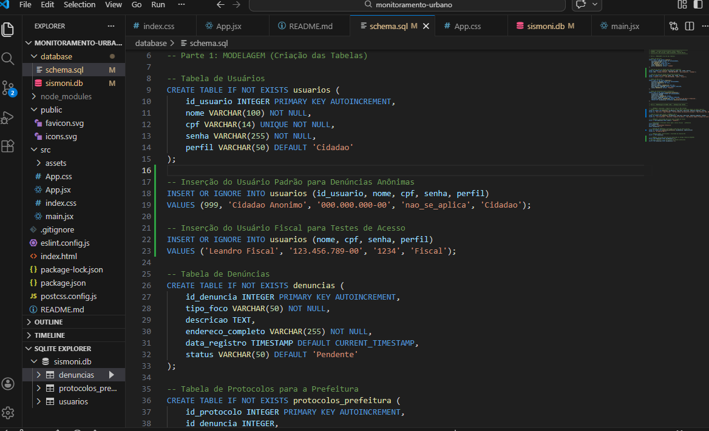
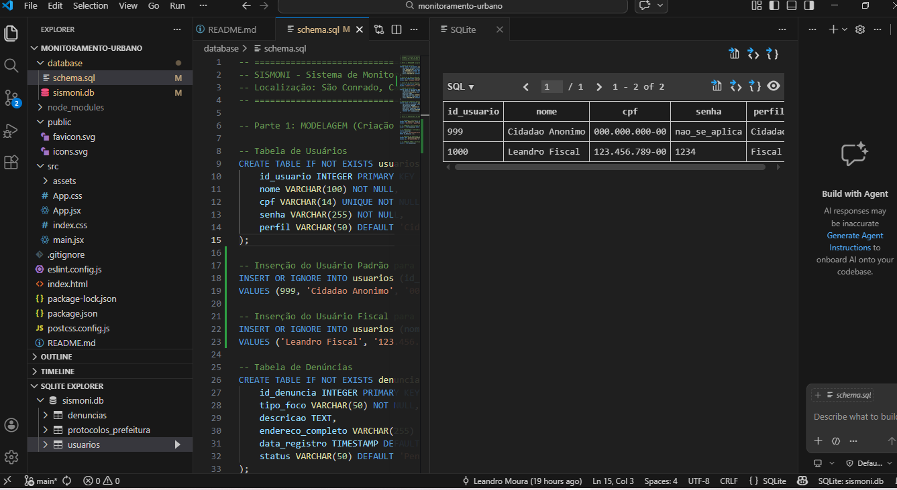
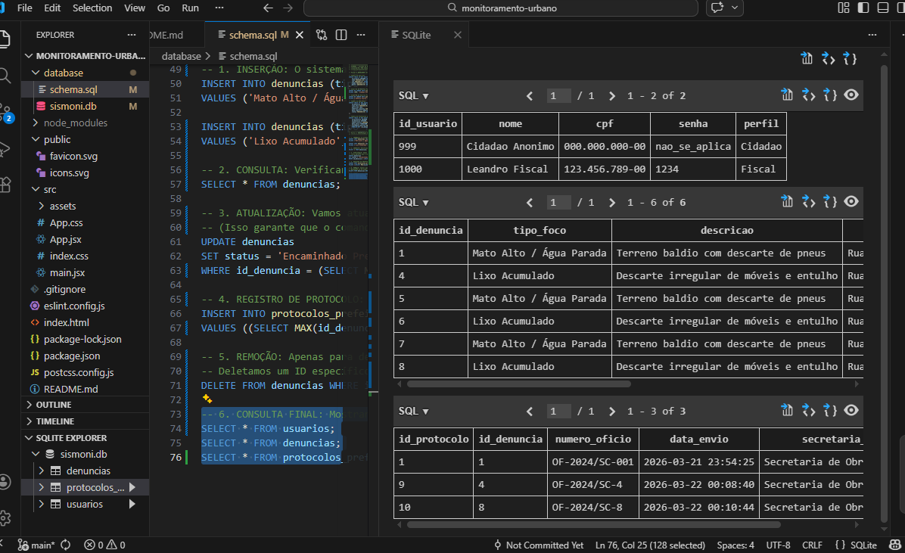
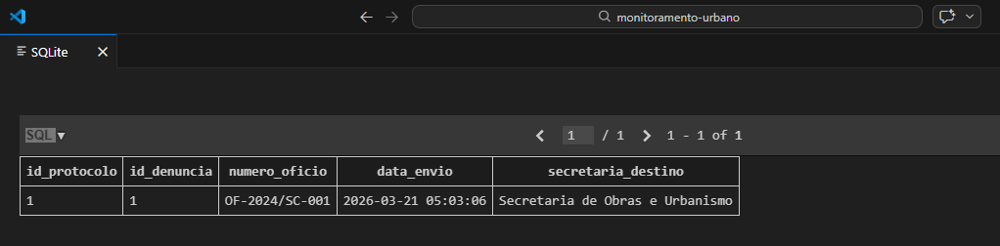

# SISMONI - Sistema de Monitoramento Urbano (Bairro São Conrado - UFMS)


O **SISMONI** é um protótipo funcional desenvolvido para a disciplina de **Projeto Integrador II (UFMS)**. O sistema foca na fiscalização de terrenos baldios e no controle de riscos socioambientais no bairro São Conrado, em Campo Grande/MS.

---

## 📑 Evolução do Projeto

### **Módulo 3: Persistência e Inteligência de Dados (Atual)**
* **Modelagem Relacional:** Estruturação em **SQLite** com tabelas normalizadas em **3ª Forma Normal (3FN)**.
* **Integridade Referencial:** Uso de chaves primárias e estrangeiras para vincular usuários, denúncias e protocolos.
* **Manipulação via SQL:** Scripts de criação (DDL) e testes de validação (DML) com suporte a múltiplos registros.
* **Controle de Versão Profissional:** Gerenciamento via **Git/GitHub**.

#### 📸 Evidências do Banco de Dados:
* **Estrutura das Tabelas (DDL):**

* **Gestão de Usuários e Perfis:**

* **Validação de Dados (DML - Insert/Update/Delete):**

* **Geração de Protocolos:**


### **Módulo 2: Interface e Experiência do Usuário (Frontend)**
* **Navegação Dinâmica (SPA):** Interface em React com estados para alternância de telas.
* **Acesso Dual:** Fluxos distintos para Cidadãos e Fiscais.
* **Design Responsivo:** Estilização com **Tailwind CSS** (Mobile-First).

---

## 🛠️ Tecnologias Utilizadas

| Camada | Tecnologia |
| :--- | :--- |
| **Frontend** | React.js, Vite, Tailwind CSS |
| **Banco de Dados** | SQLite 3, Linguagem SQL |
| **Ferramentas** | VS Code, Git, GitHub |
| **Documentação** | PlantUML, ABNT, LGPD |

---

## ⚖️ Governança e Segurança
O tratamento das informações coletadas segue rigorosamente os preceitos da [Lei Geral de Proteção de Dados (LGPD - Lei nº 13.709/2018)](https://www.planalto.gov.br/ccivil_03/_ato2015-2018/2018/lei/l13709.htm), assegurando a privacidade dos usuários e a integridade do monitoramento socioambientais.

---

## 📁 Estrutura de Arquivos Críticos
- `/modulo3_sismoni.sql`: Script de criação e testes do banco de dados.
- `/prints/`: Pasta contendo as evidências de execução do SQL.
- `/src`: Código-fonte da interface em React.

---

## 📦 Como executar o projeto localmente

1. **Clone o repositório:**
   ```bash
   git clone [https://github.com/leandromouraufms/monitoramento-urbano.git](https://github.com/leandromouraufms/monitoramento-urbano.git)