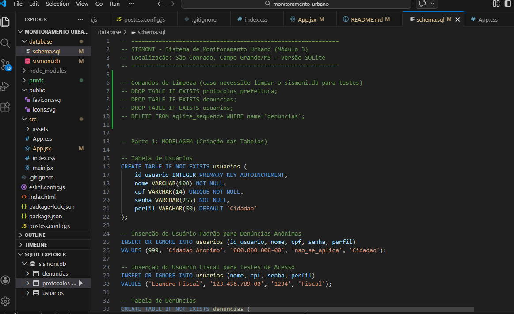
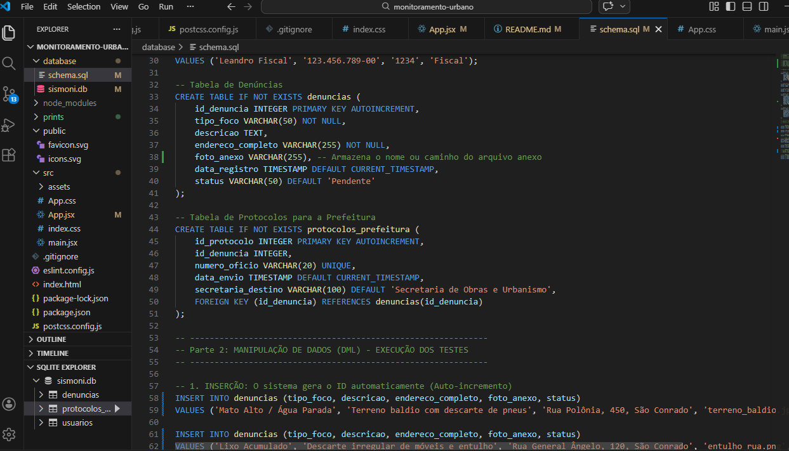
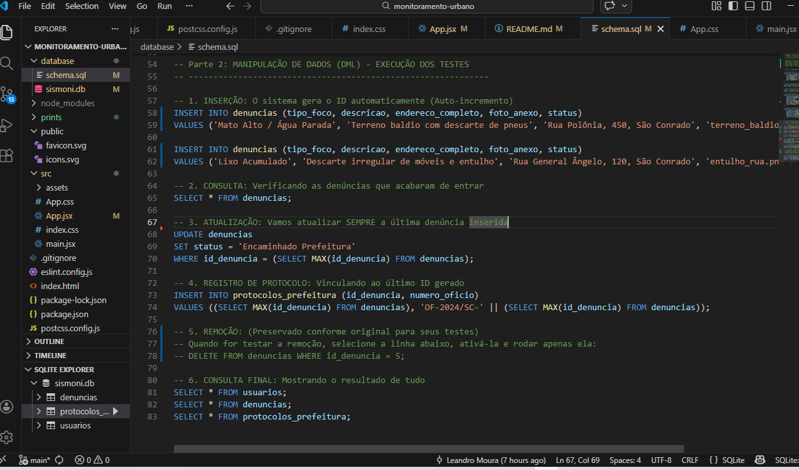
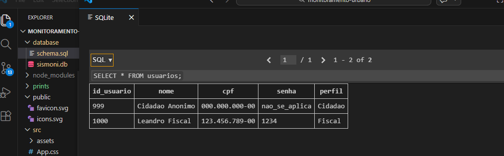
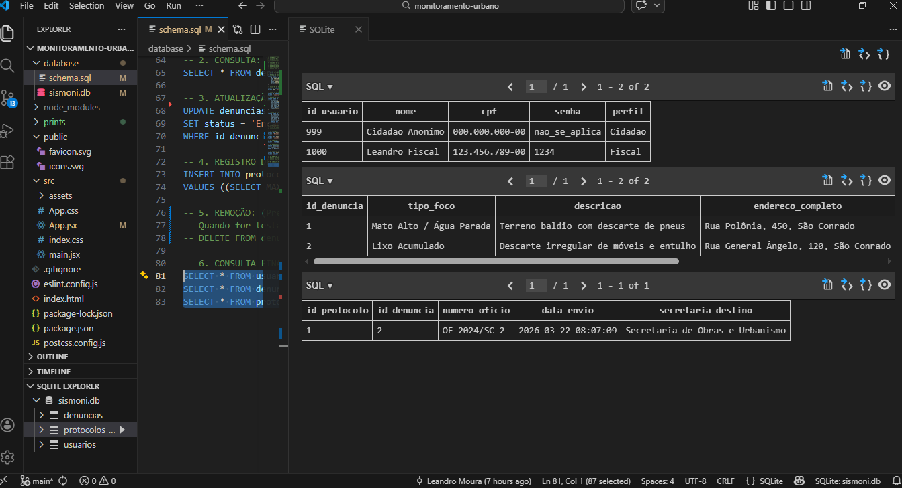
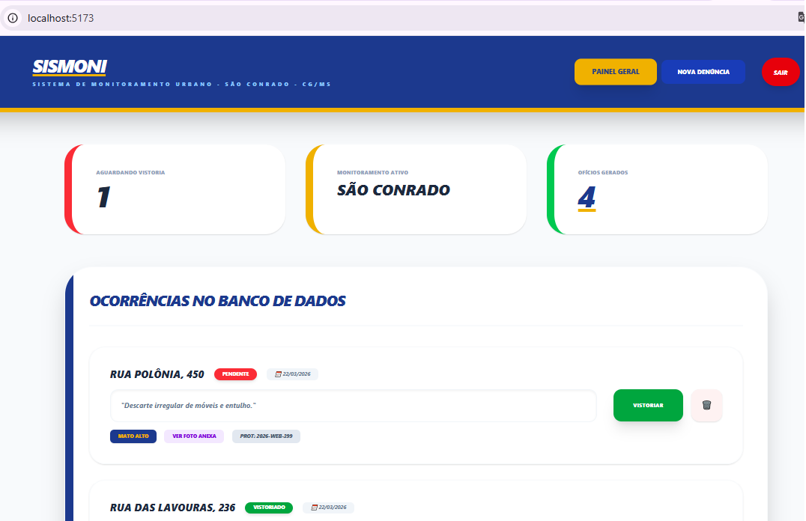
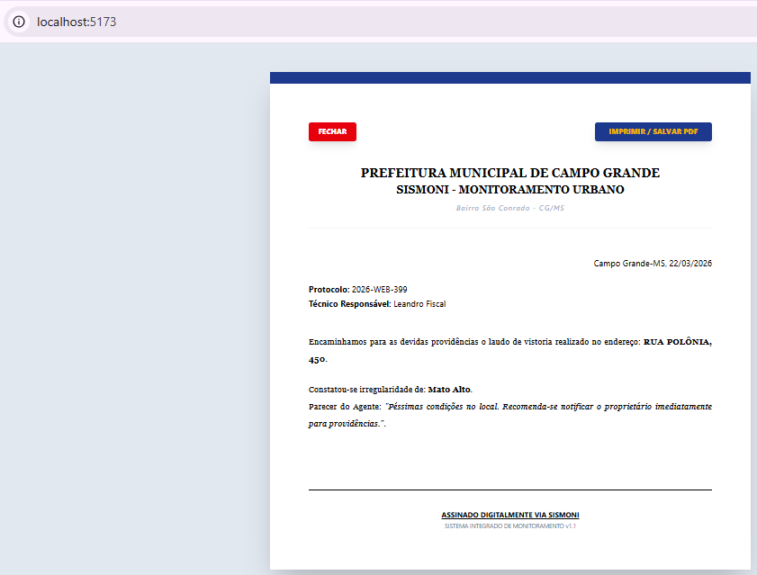
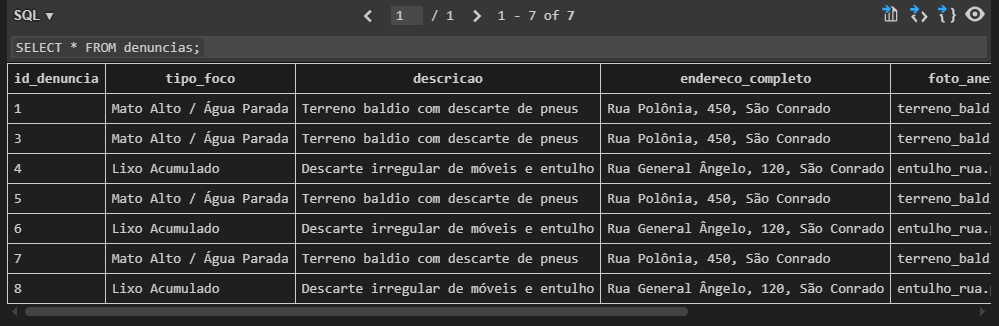
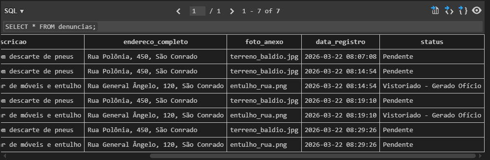

# SISMONI - Sistema de Monitoramento Urbano (Bairro São Conrado - Campo Grande-MS - UFMS)


O **SISMONI** é um protótipo funcional desenvolvido para a disciplina de **Projeto Integrador II (UFMS)**. O sistema foca na fiscalização de terrenos baldios e no controle de riscos socioambientais no bairro São Conrado, em Campo Grande/MS.

---

### ⚙️ Compatibilização Técnica (Interface x Persistência)
Embora o projeto ainda não utilize uma camada de Back-end para conexão em tempo real, foi realizada a **compatibilização semântica e estrutural** entre o Front-end (React) e o Banco de Dados (SQLite):

* **Sincronização de Campos:** Os nomes e tipos de dados utilizados nos formulários do `App.jsx` (ex: `tipo_foco`, `endereco_completo`) foram padronizados de acordo com as colunas definidas no `schema.sql`.
* **Fluxo de Status:** A lógica de transição de estados na interface reflete exatamente as regras de negócio implementadas via comandos SQL (ex: o status **'Vistoriado - Gerado Ofício'**).
* **Preparação para Full-Stack:** Esta organização garante que, em módulo futuro, a integração via API ocorra sem a necessidade de refatorar as estruturas de dados já existentes.

---

## 📑 Evolução do Projeto

### **Módulo 3: Persistência e Inteligência de Dados (Atual)**
* **Modelagem Relacional:** Estruturação em **SQLite** com tabelas normalizadas em **3ª Forma Normal (3FN)**.
* **Suporte a Evidências:** Implementação de armazenamento de caminhos de imagens (`foto_anexo`) para fiscalização.
* **Integridade Referencial:** Uso de chaves primárias e estrangeiras para vincular usuários, denúncias e protocolos.
* **Manipulação via SQL:** Scripts de criação (DDL), automação de status (**Vistoriado - Gerado Ofício**) e geração de protocolos (DML).
* **Controle de Versão Profissional:** Gerenciamento via **Git/GitHub**.

#### 📸 Evidências do Banco de Dados:
* **Estrutura das Tabelas e Coluna de Fotos (DDL):**

* **Lógica de Inserção e Automação de Status (DML):**

* **Manutenção e Comentários de Teste:**

* **Gestão de Usuários e Perfis:**

* **Resultado Consolidado (Visão Geral Integrada):**

* **Interface do Painel e Documento Gerado:**


* **Atualização, Remoção e Persistência de Dados:**



### **Módulo 2: Interface e Experiência do Usuário (Frontend)**
* **Navegação Dinâmica (SPA):** Interface em React com estados para alternância de telas.
* **Acesso Dual:** Fluxos distintos para Cidadãos e Fiscais.
* **Design Responsivo:** Estilização com **Tailwind CSS** (Mobile-First).

---

## 🛠️ Tecnologias Utilizadas

| Camada | Tecnologia |
| :--- | :--- |
| **Frontend** | React.js, Vite, Tailwind CSS |
| **Banco de Dados** | SQLite 3, Linguagem SQL |
| **Ferramentas** | VS Code, Git, GitHub |
| **Documentação** | PlantUML, ABNT, LGPD |

---

## ⚖️ Governança e Segurança
O tratamento das informações coletadas segue rigorosamente os preceitos da [Lei Geral de Proteção de Dados (LGPD - Lei nº 13.709/2018)](https://www.planalto.gov.br/ccivil_03/_ato2015-2018/2018/lei/l13709.htm), assegurando a privacidade dos usuários e a integridade do monitoramento socioambientais.

---

## 📁 Estrutura de Arquivos Críticos
- `/modulo3_sismoni.sql`: Script de criação e testes do banco de dados.
- `/prints/`: Pasta contendo as evidências de execução do SQL.
- `/src`: Código-fonte da interface em React.

---

## 📦 Como executar o projeto localmente

1. **Clone o repositório:**
   ```bash
   git clone https://github.com/leandromouraufms/monitoramento-urbano.git